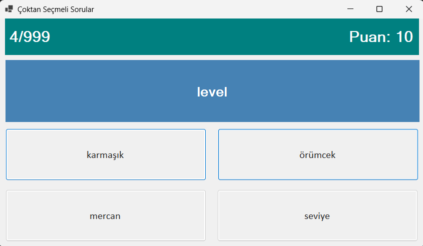

# 🎮 English–Turkish Vocabulary Quiz App

> 🎓 Part of my **[Computer Engineering Academic Portfolio](https://github.com/Lucaskatalahali/computer-engineering-projects)**.

The objective of this project was to develop a Windows Forms application that helps users practice English and Turkish vocabulary through an interactive quiz.

---

## 🛠 Technologies

- C#
- .NET WinForms

---

## ✨ Features

- English–Turkish vocabulary quiz
- Multiple-choice questions
- Randomized answer options
- Score tracking
- Graphical user interface (Windows Forms)

---

## 📄 Documentation

The `/KelimeEzberleme/docs` folder contains the original Project Specification

---

## 📷 Screenshot

### Main Interface

---

## ▶️ How to Run

Open the solution (`.sln`) in Visual Studio, build the project, and run it using **Ctrl + F5** or **F5**.

## 🎓 Academic Information

- **University:** Sakarya University
- **Faculty:** Faculty of Computer and Information Sciences
- **Department:** Computer Engineering
- **Course:** Object-Oriented Programming
- Project Grade: 96/100

---

## 📌 Notes

This repository preserves the original academic project exactly as it was submitted and evaluated.

For more academic projects, visit my **[Computer Engineering Projects](https://github.com/Lucaskatalahali/computer-engineering-projects)** repository.
